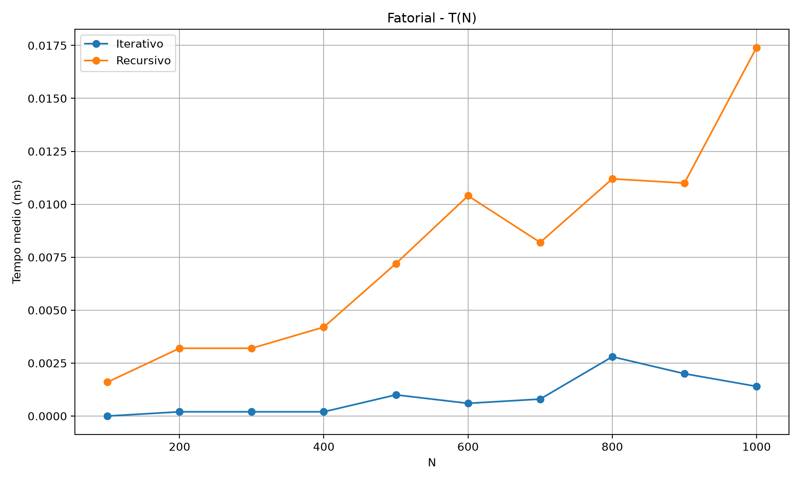
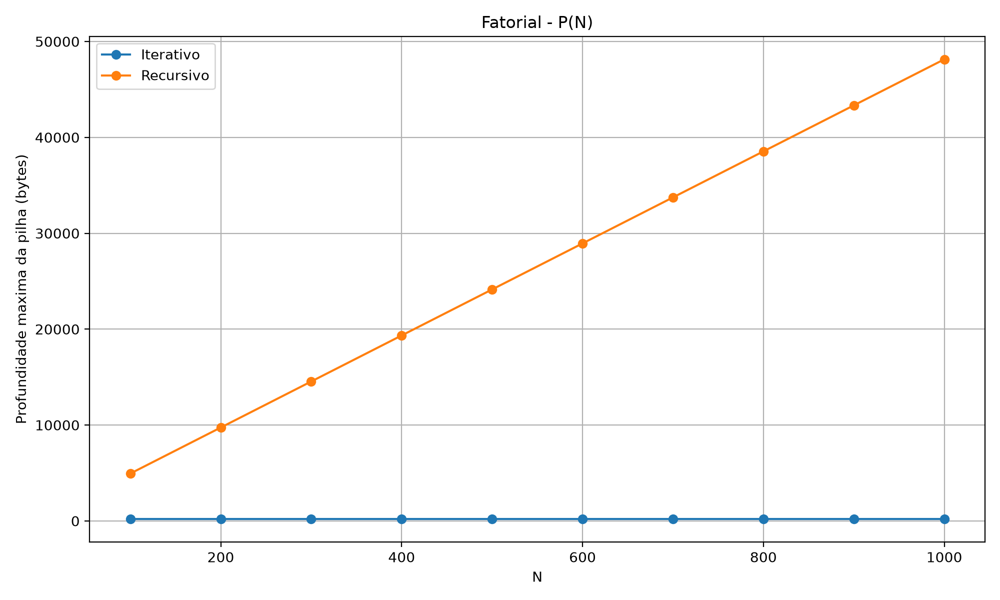
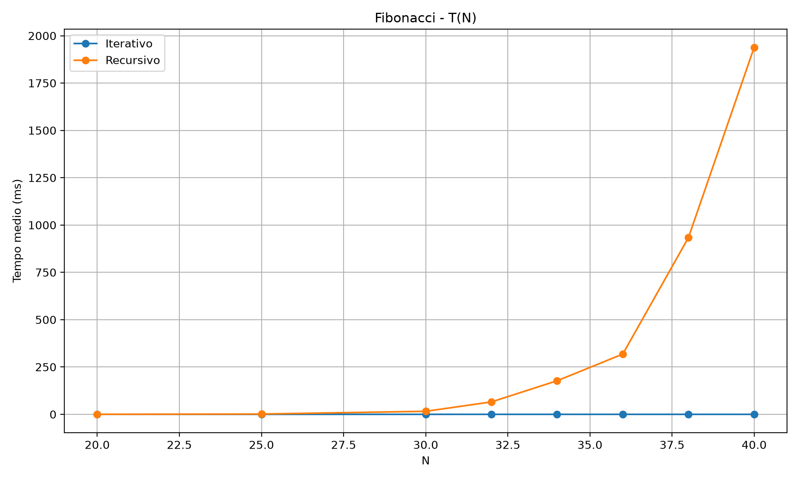
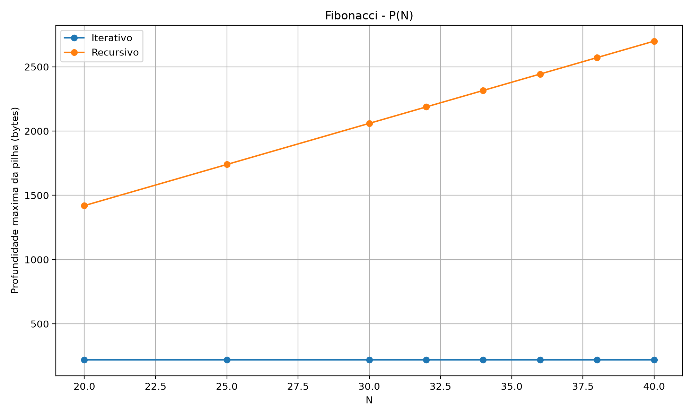
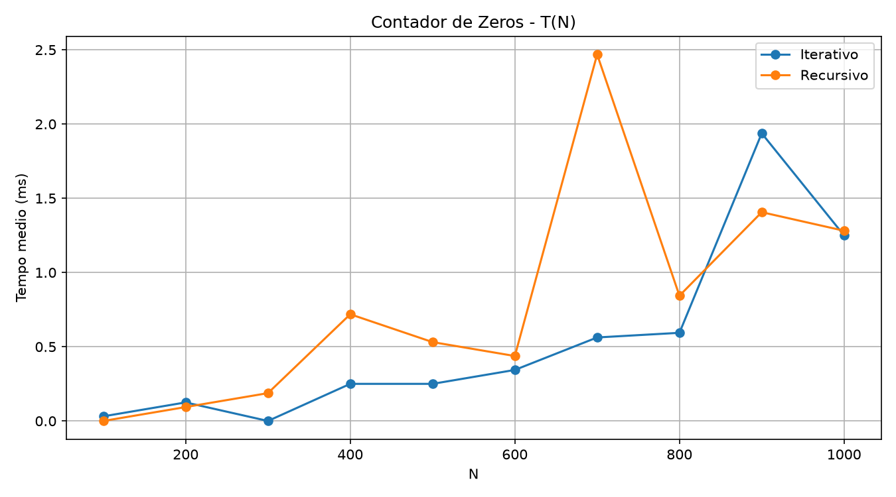
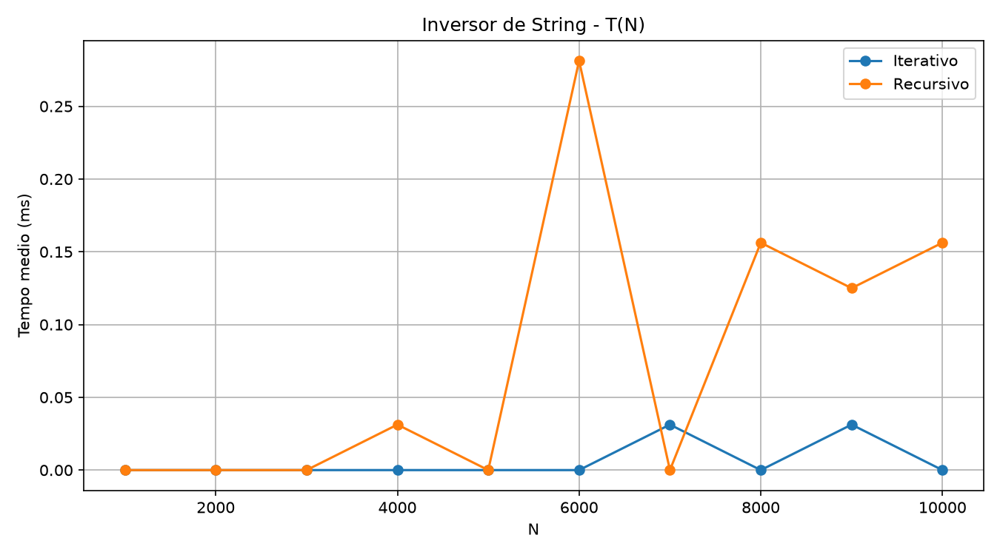
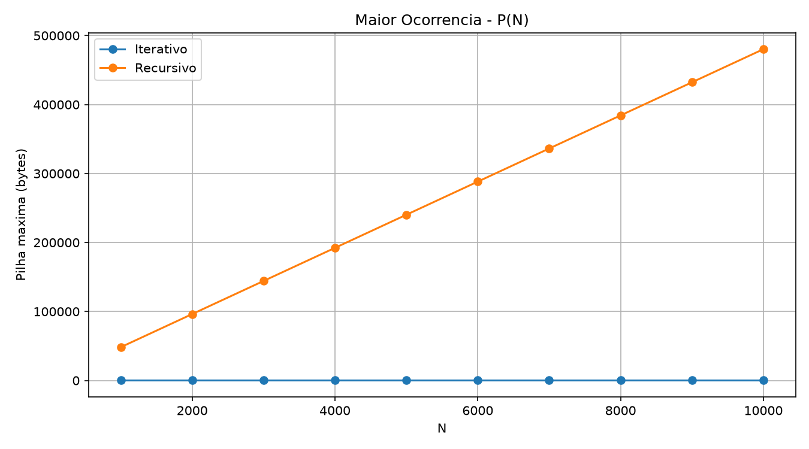

# Algorithm Analysis

Repositório dedicado aos estudos, implementações e relatórios desenvolvidos na disciplina de Análise de Algoritmos do curso de Ciência da Computação.

O projeto reúne implementações em C e experimentos relacionados à análise de desempenho, complexidade de algoritmos, recursividade e utilização da pilha de execução.

## Relatórios

| Relatório | Tema | Status |
| --- | --- | --- |
| 01 | Análise Empírica — Fatorial e Fibonacci | Concluído |
| 02 | Complexidade Espacial e Temporal | Concluído |
| 03 | A definir | Pendente |
| 04 | A definir | Pendente |
| 05 | A definir | Pendente |
| 06 | A definir | Pendente |
| 07 | A definir | Pendente |

## Relatório 01 — Análise Empírica

Comparação entre implementações iterativas e recursivas dos algoritmos de Fatorial e Fibonacci.

Foram analisados:

- tempo médio de execução T(N);
- profundidade máxima da pilha P(N);
- comportamento das versões iterativas e recursivas;
- variação do desempenho conforme o valor de N.

### Resultados

<p align="center">
  
  
</p>

<p align="center">
  
  
</p>

## Relatório 02 — Complexidade Espacial e Temporal

Análise teórica e experimental de implementações iterativas e recursivas para três problemas:

- contador de zeros em matriz;
- inversão de string;
- maior ocorrência de uma mesma letra em uma string.

Para cada problema foram analisados:

- complexidade temporal utilizando notação Big O;
- complexidade espacial com foco no consumo da pilha;
- demonstrações por indução;
- tempo médio de execução;
- consumo máximo da pilha;
- comparação entre os resultados teóricos e experimentais.

Os experimentos foram executados 32 vezes para cada valor de N, utilizando a média das execuções para a análise temporal.

### Resultados

<p align="center">
  
  
</p>

<p align="center">
  
  
</p>

<p align="center">
  
  
</p>

## Tecnologias utilizadas

- C
- GCC
- Python
- Pandas
- Matplotlib
- CSV
- Git
- GitHub

## Estrutura do projeto

```text
algorithm-analysis/
│
├── report-01-empirical-analysis/
│   ├── graficos/
│   │   ├── fatorial_pilha.png
│   │   ├── fatorial_tempo.png
│   │   ├── fibonacci_pilha.png
│   │   └── fibonacci_tempo.png
│   │
│   ├── relatorio/
│   ├── resultados/
│   │   ├── fatorial_iterativo.csv
│   │   ├── fatorial_recursivo.csv
│   │   ├── fibonacci_iterativo.csv
│   │   └── fibonacci_recursivo.csv
│   │
│   ├── fatorial_iterativo.c
│   ├── fatorial_recursivo.c
│   ├── fibonacci_iterativo.c
│   ├── fibonacci_recursivo.c
│   └── plot.py
│
├── report-2-spatial-temporal-complexity/
│   ├── charts/
│   │   ├── matrix-zero-stack.png
│   │   ├── matrix-zero-time.png
│   │   ├── most-frequent-stack.png
│   │   ├── most-frequent-time.png
│   │   ├── string-reverse-stack.png
│   │   └── string-reverse-time.png
│   │
│   ├── report/
│   │   ├── Relatorio-1-Complexidade-Espacial-e-Temporal-Grupo-5.docx
│   │   └── Relatorio-1-Complexidade-Espacial-e-Temporal-Grupo-5.pdf
│   │
│   ├── results/
│   │   ├── matrix-zero-iterative.csv
│   │   ├── matrix-zero-recursive.csv
│   │   ├── most-frequent-iterative.csv
│   │   ├── most-frequent-recursive.csv
│   │   ├── string-reverse-iterative.csv
│   │   └── string-reverse-recursive.csv
│   │
│   ├── src/
│   │   ├── matrix-zero-iterative.c
│   │   ├── matrix-zero-recursive.c
│   │   ├── most-frequent-iterative.c
│   │   ├── most-frequent-recursive.c
│   │   ├── string-reverse-iterative.c
│   │   └── string-reverse-recursive.c
│   │
│   └── plot.py
│
├── .gitignore
└── README.md
```
