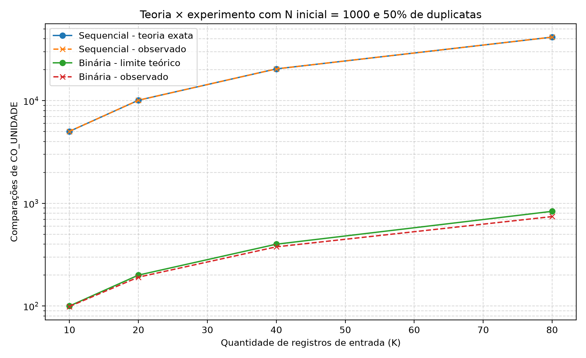
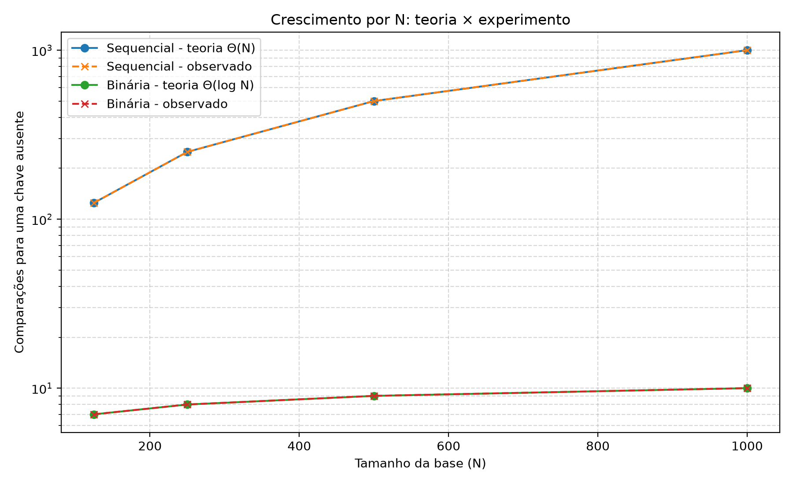
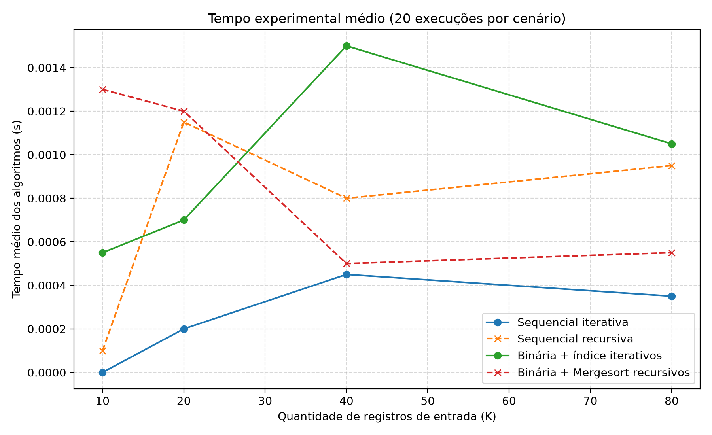

# Algorithm Analysis

Repositório dedicado aos estudos, implementações e relatórios desenvolvidos na disciplina de **Análise de Algoritmos** do curso de Ciência da Computação.

O projeto reúne implementações em C, análises de complexidade temporal e espacial, demonstrações matemáticas e validações experimentais.

## Relatórios

| Relatório | Tema | Status |
| --- | --- | --- |
| 01 | Análise Empírica — Fatorial e Fibonacci | Concluído |
| 02 | Complexidade Espacial e Temporal | Concluído |
| 03 | Cadastro de Bolsistas | Concluído |
| 04 | Busca Sequencial, MergeSort e Busca Binária | Concluído |
| 05 | A definir | Pendente |
| 06 | A definir | Pendente |
| 07 | A definir | Pendente |

---

## Relatório 01 — Análise Empírica

Comparação entre implementações iterativas e recursivas dos algoritmos de **Fatorial** e **Fibonacci**.

Foram analisados tempo de execução, profundidade da pilha e crescimento dos algoritmos em função do tamanho da entrada.

<p align="center">
  
  
</p>

<p align="center">
  
  
</p>

---

## Relatório 02 — Complexidade Espacial e Temporal

Análise teórica e experimental de versões iterativas e recursivas para:

- contador de zeros em matriz;
- inversão de string;
- maior ocorrência de uma mesma letra.

Foram analisadas as complexidades temporal e espacial, com demonstrações por indução e validação experimental.

<p align="center">
  
  
</p>

<p align="center">
  
  
</p>

<p align="center">
  
  
</p>

---

## Relatório 03 — Cadastro de Bolsistas

Implementação e análise de um programa em C responsável pela transferência de registros entre arquivos CSV, evitando a inserção de nomes já existentes no arquivo de destino.

A redundância é verificada por **busca sequencial**, utilizando exclusivamente o campo `Nome`.

Considerando `n` novos registros e `Q` registros existentes inicialmente:

```text
C(n,Q) = nQ + n(n - 1) / 2
```

Para `Q` fixo:

```text
Θ(n²)
```

### Validação experimental

Nos experimentos foi utilizado `Q = 1`.

| Nomes inseridos | Observado | Teórico | Diferença |
| ---: | ---: | ---: | ---: |
| 10 | 55 | 55 | 0 |
| 20 | 210 | 210 | 0 |
| 40 | 820 | 820 | 0 |
| 80 | 3240 | 3240 | 0 |
| 160 | 12880 | 12880 | 0 |

<p align="center">
  
</p>

---

## Relatório 04 — Busca Sequencial, MergeSort e Busca Binária

Comparação teórica e experimental de algoritmos de busca e ordenação aplicados à detecção de registros duplicados em uma base pública do **Cadastro Nacional de Estabelecimentos de Saúde — CNES**.

A coluna utilizada como chave foi `CO_UNIDADE`, por apresentar valores únicos e não estar ordenada no arquivo original.

Foram implementadas quatro versões:

| Algoritmo | Temporal | Espaço adicional |
| --- | --- | --- |
| Busca sequencial iterativa | Θ(N) | Θ(1) |
| Busca sequencial recursiva | Θ(N) | Θ(N) |
| Busca binária iterativa | Θ(log N) | Θ(1) |
| Busca binária recursiva | Θ(log N) | Θ(log N) |

O vetor utilizado pela busca binária é previamente ordenado em memória RAM com **MergeSort**:

```text
T(N) = 2T(N/2) + Θ(N)
```

resultando em:

```text
Θ(N log N)
```

O arquivo CSV físico permanece desordenado; apenas o índice mantido em memória é ordenado.

### Validação experimental

O experimento principal utilizou uma base inicial com:

```text
N = 1000
```

Para cada valor de `K`, metade dos registros já existia e metade era nova.

| K | Sequencial observado | Binária observada |
| ---: | ---: | ---: |
| 10 | 5.025 | 99 |
| 20 | 10.100 | 191 |
| 40 | 20.400 | 377 |
| 80 | 41.600 | 743 |

Na busca sequencial, os resultados observados coincidiram exatamente com o modelo teórico.

Também foi realizado um experimento variando `N` para demonstrar diretamente o crescimento dos algoritmos:

| N | Sequencial | Binária |
| ---: | ---: | ---: |
| 125 | 125 | 7 |
| 250 | 250 | 8 |
| 500 | 500 | 9 |
| 1000 | 1000 | 10 |

Quando `N` dobra, a busca sequencial também dobra seu número de comparações, enquanto a busca binária acrescenta aproximadamente uma comparação.

<p align="center">
  
  
</p>

<p align="center">
  
</p>

### Executando o Relatório 04

Acesse o diretório:

```powershell
cd .\report-04-search-and-sort
```

Compile:

```powershell
gcc -std=c11 -Wall -Wextra -Wpedantic -O0 .\src\seq_iterativa.c -o seq_iterativa
gcc -std=c11 -Wall -Wextra -Wpedantic -O0 .\src\seq_recursiva.c -o seq_recursiva
gcc -std=c11 -Wall -Wextra -Wpedantic -O0 .\src\bin_iterativa.c -o bin_iterativa
gcc -std=c11 -Wall -Wextra -Wpedantic -O0 .\src\bin_recursiva.c -o bin_recursiva
```

Execute os experimentos:

```powershell
python.exe .\scripts\benchmark.py
python.exe .\scripts\benchmark_crescimento.py
python.exe .\scripts\plot.py
```

Os detalhes completos de preparação dos dados, compilação, execução e metodologia estão disponíveis em:

```text
report-04-search-and-sort/README.md
```

---

## Estrutura do projeto

```text
algorithm-analysis/
│
├── report-01-empirical-analysis/
│   ├── graficos/
│   ├── relatorio/
│   ├── resultados/
│   ├── *.c
│   └── plot.py
│
├── report-02-spatial-temporal-complexity/
│   ├── charts/
│   ├── report/
│   ├── results/
│   ├── src/
│   └── plot.py
│
├── report-03-scholarship-registration-analysis/
│   ├── charts/
│   ├── data/
│   ├── report/
│   ├── results/
│   ├── src/
│   ├── prepare_tests.py
│   └── plot.py
│
├── report-04-search-and-sort/
│   ├── charts/
│   ├── data/
│   ├── report/
│   ├── results/
│   ├── scripts/
│   ├── src/
│   └── README.md
│
├── .gitignore
└── README.md
```

## Tecnologias

- C
- GCC
- Python
- Pandas
- Matplotlib
- CSV
- Git
- GitHub