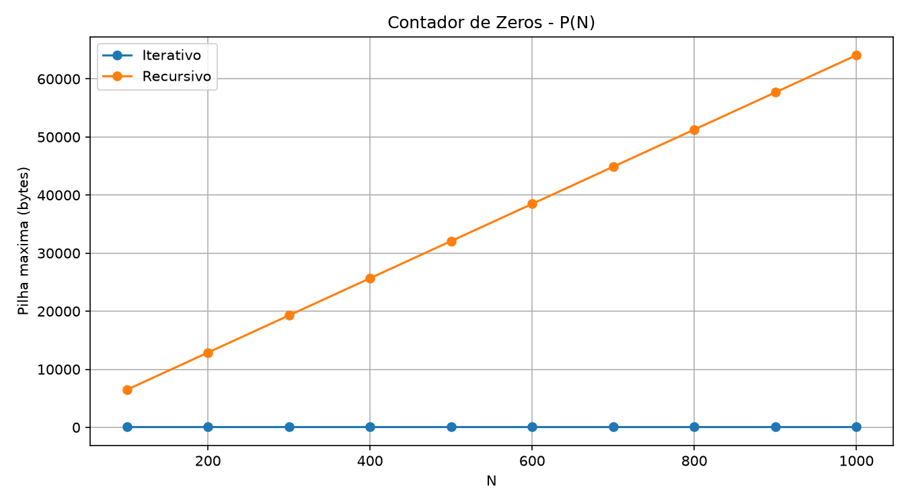
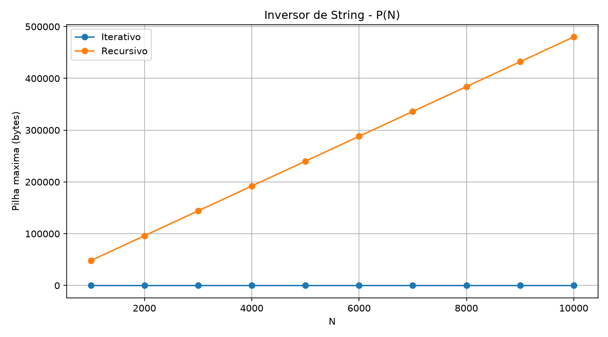
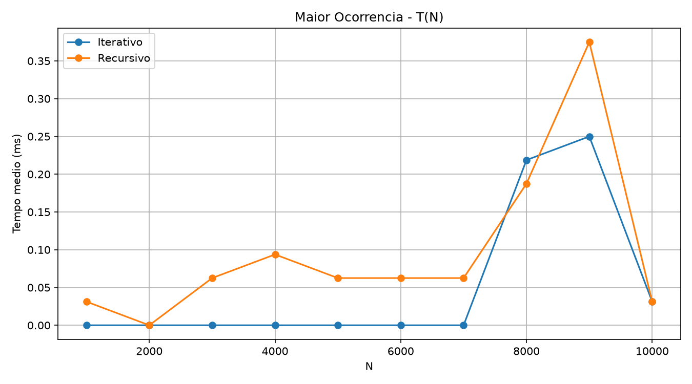
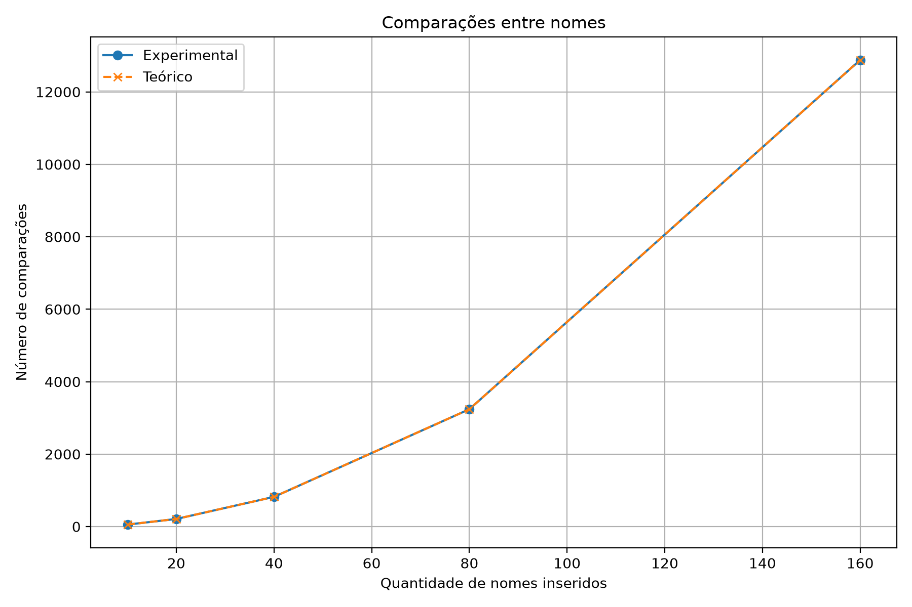

# Algorithm Analysis

Repositório dedicado aos estudos, implementações e relatórios desenvolvidos na disciplina de **Análise de Algoritmos** do curso de Ciência da Computação.

O projeto reúne implementações em C, análises de complexidade temporal e espacial, demonstrações matemáticas e validações experimentais.

## Relatórios

| Relatório | Tema | Status |
| --- | --- | --- |
| 01 | Análise Empírica — Fatorial e Fibonacci | Concluído |
| 02 | Complexidade Espacial e Temporal | Concluído |
| 03 | Análise de Algoritmos Aplicada ao Cadastro de Bolsistas | Concluído |
| 04 | A definir | Pendente |
| 05 | A definir | Pendente |
| 06 | A definir | Pendente |
| 07 | A definir | Pendente |

---

## Relatório 01 — Análise Empírica

Comparação entre implementações iterativas e recursivas dos algoritmos de **Fatorial** e **Fibonacci**.

Foram analisados:

- tempo médio de execução;
- profundidade máxima da pilha;
- comportamento das versões iterativas e recursivas;
- crescimento em função do tamanho da entrada.

<p align="center">
  
  
</p>

<p align="center">
  
  
</p>

---

## Relatório 02 — Complexidade Espacial e Temporal

Análise teórica e experimental de versões iterativas e recursivas para três problemas:

- contador de zeros em matriz;
- inversão de string;
- maior ocorrência de uma mesma letra.

Foram analisadas as complexidades temporal e espacial, com demonstrações por indução e validação experimental.

<p align="center">
  
  
</p>

<p align="center">
  
  
</p>

<p align="center">
  
  
</p>

---

## Relatório 03 — Cadastro de Bolsistas

Implementação e análise de um programa em C responsável pela transferência de registros entre arquivos CSV, evitando a inserção de bolsistas cujo campo `Nome` já esteja presente no arquivo de destino.

A verificação de redundância utiliza **busca sequencial** e considera exclusivamente o campo `Nome`.

Quando um nome já existe:

- o registro não é inserido;
- uma mensagem de erro é exibida;
- o processamento continua normalmente.

O programa também contabiliza todas as comparações realizadas entre nomes e registra os resultados em um arquivo CSV.

### Análise teórica

Considerando:

- `n` novos bolsistas;
- `Q` cadastros existentes inicialmente;

a quantidade de comparações é:

```text
Q
Q + 1
Q + 2
...
Q + n - 1
```

Portanto:

```text
C(n,Q) = nQ + n(n - 1) / 2
```

Considerando `Q` fixo, o termo dominante é quadrático:

```text
Θ(n²)
```

Logo:

```text
O(n²)
```

### Validação experimental

Nos experimentos foi utilizado:

```text
Q = 1
```

Assim:

```text
C(n) = n(n + 1) / 2
```

| Nomes inseridos | Observado | Teórico | Diferença |
| ---: | ---: | ---: | ---: |
| 10 | 55 | 55 | 0 |
| 20 | 210 | 210 | 0 |
| 40 | 820 | 820 | 0 |
| 80 | 3240 | 3240 | 0 |
| 160 | 12880 | 12880 | 0 |

Os resultados experimentais coincidiram exatamente com os valores previstos pelo modelo matemático.

Quando `n` dobra, a quantidade de comparações se aproxima de quatro vezes o valor anterior, comportamento esperado para uma função quadrática.

<p align="center">
  
</p>

---

## Executando o Relatório 03

### Requisitos

- GCC
- Python 3
- Pandas
- Matplotlib

Caso necessário:

```powershell
python.exe -m pip install pandas matplotlib
```

### Acessar o projeto

A partir da raiz do repositório:

```powershell
cd .\report-03-scholarship-registration-analysis
```

### Preparar os testes

```powershell
python.exe .\prepare_tests.py
```

O script gera conjuntos com:

```text
10
20
40
80
160
```

nomes distintos, além do cadastro inicial utilizado nos experimentos e de um caso específico de redundância.

### Compilar

```powershell
gcc -std=c11 -Wall -Wextra -O0 .\src\copiador.c -o copiador
```

### Executar

Formato geral:

```powershell
.\copiador.exe <origem.csv> <destino.csv> <estatisticas.csv>
```

Exemplo com 10 nomes:

```powershell
Copy-Item .\data\cadastro-base.csv .\results\cadastro-10.csv -Force

.\copiador.exe .\data\teste-10.csv .\results\cadastro-10.csv .\results\estatisticas.csv
```

Resultado esperado:

```text
Cadastros iniciais: 1
Nomes inseridos: 10
Comparacoes: 55
```

### Testar redundância

```powershell
Copy-Item .\data\cadastro-base.csv .\results\cadastro-redundancia.csv -Force

.\copiador.exe .\data\teste-redundancia.csv .\results\cadastro-redundancia.csv .\results\estatisticas-redundancia.csv
```

Quando um nome repetido é encontrado:

```text
ERRO: nome redundante encontrado: NOME
```

O registro redundante não é inserido e o processamento continua normalmente.

### Gerar análise e gráfico

```powershell
python.exe .\plot.py
```

São gerados:

```text
results/comparacao.csv
charts/comparacoes.png
```

---

## Estrutura do projeto

```text
algorithm-analysis/
│
├── report-01-empirical-analysis/
│   ├── graficos/
│   ├── relatorio/
│   ├── resultados/
│   ├── *.c
│   └── plot.py
│
├── report-02-spatial-temporal-complexity/
│   ├── charts/
│   ├── report/
│   ├── results/
│   ├── src/
│   └── plot.py
│
├── report-03-scholarship-registration-analysis/
│   ├── charts/
│   │   └── comparacoes.png
│   │
│   ├── data/
│   │   ├── bolsistas-2025.csv
│   │   ├── cadastro-base.csv
│   │   └── teste-*.csv
│   │
│   ├── report/
│   │   └── Relatorio-3-Laboratorio.pdf
│   │
│   ├── results/
│   │   ├── cadastro-*.csv
│   │   ├── comparacao.csv
│   │   └── estatisticas*.csv
│   │
│   ├── src/
│   │   └── copiador.c
│   │
│   ├── prepare_tests.py
│   └── plot.py
│
├── .gitignore
└── README.md
```

## Tecnologias

- C
- GCC
- Python
- Pandas
- Matplotlib
- CSV
- Git
- GitHub
